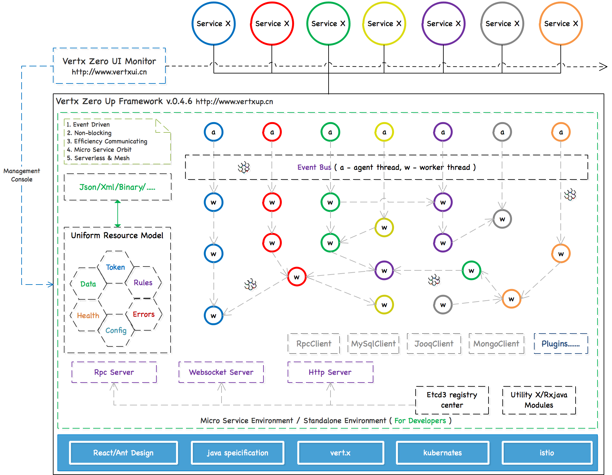

# Zero Framework

[](https://maven-badges.herokuapp.com/maven-central/cn.vertxup/vertx-zero/)  [](https://www.apache.org/licenses/LICENSE-2.0.txt)  [](https://travis-ci.org/silentbalanceyh/vertx-zero) [](https://gitter.im/vertx-up/Lobby)

This project is based on Vert.x, the idea came from Spring-Boot framework. It could help developers focus on business
requirements instead of more details of Vert.x. The project contains two parts "Up" and "Zero". "Up" means running up, "
Zero" means no more workload for high producation, you could run your project with default configuration only.

Micro Service architecture is a future focused method to design and build mature system and help more companies to
implement project faster, based on this idea, `Zero Framework` came out. It's micro-service oriented framework and will
be verified by real projects. Also it provide a tool set to help developers to do correct things. Now there are two
enterprise application cases those are implemented by `Zero`, although the number is small, but the cases could verify
that `Zero` can be used in production environment instead of tool, demo or good looks.

This framework contains four sub-projects, all these projects are located under `vertx-gaia` sub-project.

* `vertx-gaia/vertx-co`: Core Library of Zero Framework
* `vertx-gaia/vertx-tp`: Third part integration components in Zero Framework
* `vertx-gaia/vertx-ifx`：Useful plug-ins that could be supported in Zero Framework with **Infix Structure**
* `vertx-gaia/vertx-up`: Zero Up Engine with nested vert.x web container
* `vertx-gaia/vertx-rx`: Zero Up Engine with nested rxjava web container instead of web container ( Experimental Version
  for future )
* `vertx-import`: Zero Usage dependency project to perform development, provide uniform dependency for your projects.

In latest version, examples have been moved
to [https://github.com/silentbalanceyh/vertx-zero-example](https://github.com/silentbalanceyh/vertx-zero-example)
The chinese training book is [《Zero思然汀》](https://lang-yu.gitbook.io/zero/)

> If your wan't to study vert.x development skill, you can refer chinese tutorial:[《Vert.x逐陆记》](https://lang-yu.gitbook.io/vert-x/). ( In Progress )



## 0. Features

In 2019, Zero Framework has been re-factor to new version `0.6.x` and here I provide the feature list to let developers
know more details in Zero Framework: [Feature List](FEATURES.md).

## 1. Documentation

### 1.1. Official Document

* You can refer the link to see documents of Zero Framework: [Offical Document](DOCUMENT.md)
* For all module api documents you can refere [Api Document](DOCUMENT-API.md)

### 1.2. Related

* You can refer [Zero UI](http://www.vertxui.cn) to visit front-end framework, it runs 3 production cases ( CN ).
* You can refer [Spring Up](http://www.spring-up.cn) to visit spring framework bridged component ( Experimental
  Version ), it runs one production cases ( CN ).
* You can refer [Origin X](http://www.origin-x.cn) to visit knowledge management of all documents, it act as entry of
  documentation ( CN ).

## 2. Envrionment

### 2.1. Configuration in pom.xml

If you want to use Zero framework, you can add following dependency into you `pom.xml` to use Zero:

```xml

<parent>
    <artifactId>vertx-import</artifactId>
    <groupId>cn.vertxup</groupId>
    <version>0.6.2</version>
</parent>
```

### 2.2. Start Up

In your project, you can provide main entry only as following to run Zero \( Annotated with `@Up` \) .

```java
import io.vertx.up.VertxApplication;
import io.vertx.up.annotations.Up;

@Up
public class Driver {

    public static void main(final String[] args) {
        VertxApplication.run(Driver.class);
    }
}
```

Once the Zero is up, you can see following logs in your console \( The default port is `6083` \):

```
[ ZERO ] ZeroHttpAgent Http Server has been started successfully. \
    Endpoint: http://0.0.0.0:6083/
```

### 2.3. Tips

#### 2.3.1. Data Specification

In zero framework, we designed uniform data specification as following response data format for business usage:

```json
{
    "data":
}
```

After `0.5.2`, it could support freedom data format response as you wanted such as:

```shell
Hello World
1
...
```

If you want to switch to freedom mode, you can set the configuration in `vertx.yml` file:

```yaml
zero:
    freedom: true     # The default value of `freedom` is false.
```

#### 2.3.2. Logging in Zero

You can use following function in your coding to get Logger component instead of `log4j` because we have re-designed the
detail implementation of logging system.

```java
// Zero Logger initialized, connect to vert.x logging system directly but uniform managed by zero.

import io.vertx.up.log.Annal;

// Then in your class
public final class Statute {

    private static final Annal LOGGER = Annal.get(Statute.class);
    ......
}
```

## 3. Other Information

### 3.1. Case Actions

1. TLK Video Mobile System ( 0.4.6 )
2. Micro Hotel Platform ( > 0.6.0 )
3. CMDB/ITSM Platform ( > 0.6.0 )
4. Training Demo ( latest )

### 3.2. WeChat Group

You can send request to group leader: `445191171` to contact with the author team of zero.


## DESIGNED IN CHINA


