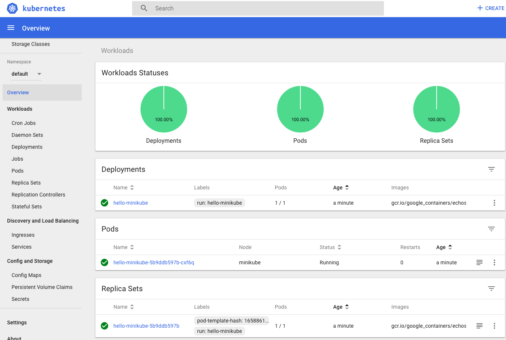
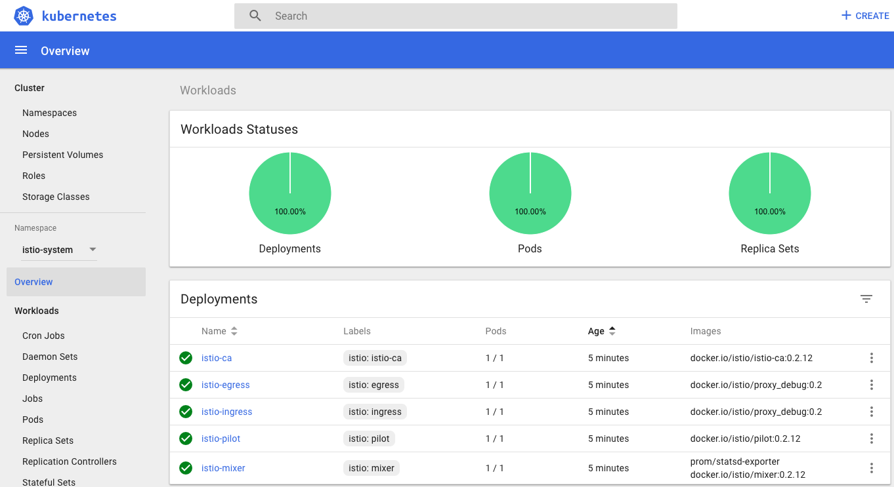
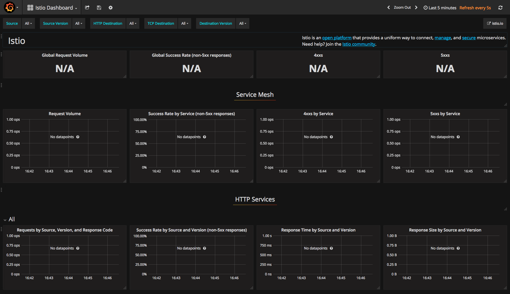
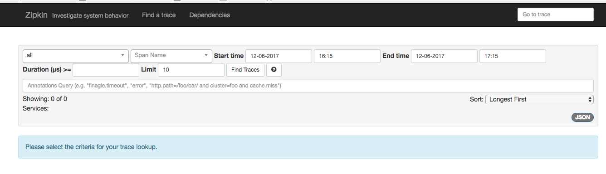
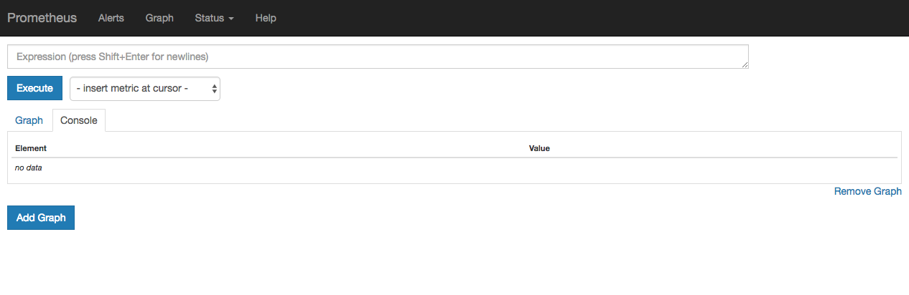

# Istio Environment

## 1. Preparing & Setup

Before you want to setup local development environment, you must setup local k8s cluster first. Please refer following
link to prepare it:

[VM Environment](https://kubernetes.io/docs/tasks/tools/install-minikube/)

* Install a hypervisor
* Install kubectl
* Install Minikube

### 1.1. Install VM ( Recommend xhyve on Mac )

Because the demo environment is MacOS, you can do as following:

```
brew install docker-machine-driver-xhyve

# docker-machine-driver-xhyve need root owner and uid, following steps are required.
$ sudo chown root:wheel $(brew --prefix)/opt/docker-machine-driver-xhyve/bin/docker-machine-driver-xhyve
$ sudo chmod u+s $(brew --prefix)/opt/docker-machine-driver-xhyve/bin/docker-machine-driver-xhyve
```

### 1.2. Minikube Install

[minikube](https://github.com/kubernetes/minikube)

MacOS

```
brew cask install minikube
```

For other system please refer above installing guide.

### 1.3. Kubernete Client

[kubectl Installing](https://kubernetes.io/docs/tasks/tools/install-kubectl/)

MacOS

```
brew install kubectl
```

### 1.4. Start Environment

1. Start minikube

   ```
   >> minikube start
   Starting local Kubernetes v1.8.0 cluster...
   Starting VM...
   Getting VM IP address...
   Moving files into cluster...
   Setting up certs...
   Connecting to cluster...
   Setting up kubeconfig...
   Starting cluster components...
   Kubectl is now configured to use the cluster.
   Loading cached images from config up.god.file.
   ```
2. Version checking

   ```
   >> kubectl version
   Client Version: version.Info{Major:"1", Minor:"8", GitVersion:"v1.8.4", \
   GitCommit:"9befc2b8928a9426501d3bf62f72849d5cbcd5a3", GitTreeState:"clean",  \
   BuildDate:"2017-11-20T19:11:02Z", GoVersion:"go1.9.2", Compiler:"gc", Platform:"darwin/amd64"}
   Server Version: version.Info{Major:"1", Minor:"8", GitVersion:"v1.8.0", \
   GitCommit:"0b9efaeb34a2fc51ff8e4d34ad9bc6375459c4a4",  GitTreeState:"clean", \
   BuildDate:"2017-11-29T22:43:34Z", GoVersion:"go1.9.1", Compiler:"gc", Platform:"linux/amd64"}
   ```
3. Setup "Hello World" with kubectl

   ```
   >> kubectl run hello-minikube --image=gcr.io/google_containers/echoserver:1.8 --port=6001
   deployment "hello-minikube" created
   ```
4. Deploy the first service

   ```
   >> kubectl expose deployment hello-minikube --type=NodePort
   service "hello-minikube" exposed
   ```
5. Open dashboard

   ```
   >> minikube dashboard
   Opening kubernetes dashboard in default browser...
   ```
6. Then you should see that browser has been opened and following page will be showed.

   

Then your basic environment has been finished.

## 2. Istio Envrionment

[Quick Start](https://istio.io/docs/setup/kubernetes/quick-start.html)

Demo example will be install istio to `~/Tool/Zero/`

1. Install and download istio

   ```
   curl -L https://git.io/getLatestIstio | sh -
   ...... # Wait for ISO up.god.file downloading finished.
   ```

2. Set Up environment.

   ```
   Add /Users/lang/Tool/Zero/istio-0.2.12/bin to your path; \
       e.g copy paste in your shell and/or ~/.profile:
   export PATH="$PATH:/Users/lang/Tool/Zero/istio-0.2.12/bin"
   # Then be sure the command "istioctl" could be used. ( Latest 0.2.12 )
   istioctl version
   Version: 0.2.12
   GitRevision: 998e0e00d375688bcb2af042fc81a60ce5264009
   GitBranch: release-0.2
   User: releng@0d29a2c0d15f
   GolangVersion: go1.8
   ```
3. Install "istio" on local K8s

   ```
   >> cd istio-0.2.12
   
   >> pwd
   /Users/lang/Tool/Zero/istio-0.2.12
   
   >> kubectl get svc -n istio-system
   No resources found.
   
   >> kubectl apply -f install/kubernetes/istio.yaml ( None TLS mode )
   namespace "istio-system" created
   ...... ( All the progress logs will be output )
   deployment "istio-ca" created
   ```

4. Ensure the four services: `istio-pilot, istio-mixer, istio-ingress, istio-egress`

   ```
   >> kubectl get svc -n istio-system
   NAME            TYPE           CLUSTER-IP       ......
   istio-egress    ClusterIP      10.97.67.39     ......
   istio-ingress   LoadBalancer   10.111.235.49   ......
   istio-mixer     ClusterIP      10.106.88.96    ......
   istio-pilot     ClusterIP      10.106.188.200  ......
   >> kubectl get pods -n istio-system
   istio-ca-5cd46b967c-kmx58        1/1       Running   0          4m
   istio-egress-56c4d999bc-dv8md    1/1       Running   0          4m
   istio-ingress-5747bb855f-n74sz   1/1       Running   0          4m
   istio-mixer-77487797f6-d5ns9     2/2       Running   0          4m
   istio-pilot-86ddcb7ff5-cmcr5     1/1       Running   0          4m
   ```

5. Select "istio-system" on the dashboard left menu

   

## 3. Addon for Istio

If you want to enable metrics collection, you can do as following:

[Reference](https://istio-releases.github.io/v0.1/docs/tasks/installing-istio.html)

```
kubectl apply -f install/kubernetes/addons/prometheus.yaml
kubectl apply -f install/kubernetes/addons/grafana.yaml
kubectl apply -f install/kubernetes/addons/servicegraph.yaml
```

It may take some time to process all the components installed.

### 3.1. Install Grafana

1. You can type following command to configure port-forwarding for `grafana`

   ```
   kubectl -n istio-system port-forward \
       $(kubectl -n istio-system get pod -l app=grafana -o jsonpath='{.items[0].metadata.name}') \
           3000:3000 &
   ```
2. Then open uri `http://localhost:3000/dashboard/db/istio-dashboard` with your browser.
3. You should see following page:

   

### 3.2. Service Graph

1. You can type following command to configure port-forwarding for `servicegraph`

   ```
   kubectl -n istio-system port-forward \
       $(kubectl get pod -n istio-system -l app=servicegraph -o jsonpath='{.items[0].metadata.name}') \
           8088:8088 &
   ```
2. Then open url `http://localhost:8088/dotviz` or `http://localhost:8088/graph` with your browser, if there exist the
   services, you should see JSON data or graph.

### 3.3. Zipkin Dashboard

1. You can type following command to configure port-forwarding for `zipkin`

   ```
   kubectl -n istio-system port-forward \
       $(kubectl get pod -n istio-system -l app=zipkin -o jsonpath='{.items[0].metadata.name}') \
           9411:9411 &
   ```
2. Then open uri `http://localhost:9411/zipkin/` with your browser:
3. You should see following page:

   

### 3.4. Prometheus

1. You can type following command to configure port-forwarding for `prometheus`

   ```
    kubectl -n istio-system port-forward \
        $(kubectl -n istio-system get pod -l app=prometheus -o jsonpath='{.items[0].metadata.name}') \
            9090:9090 &   
   ```
2. Then open uri `http://localhost:9090/graph` with your browser:
3. You should see following page:

   

## Summary

Then the docker and istio environments have been both prepared.


	
