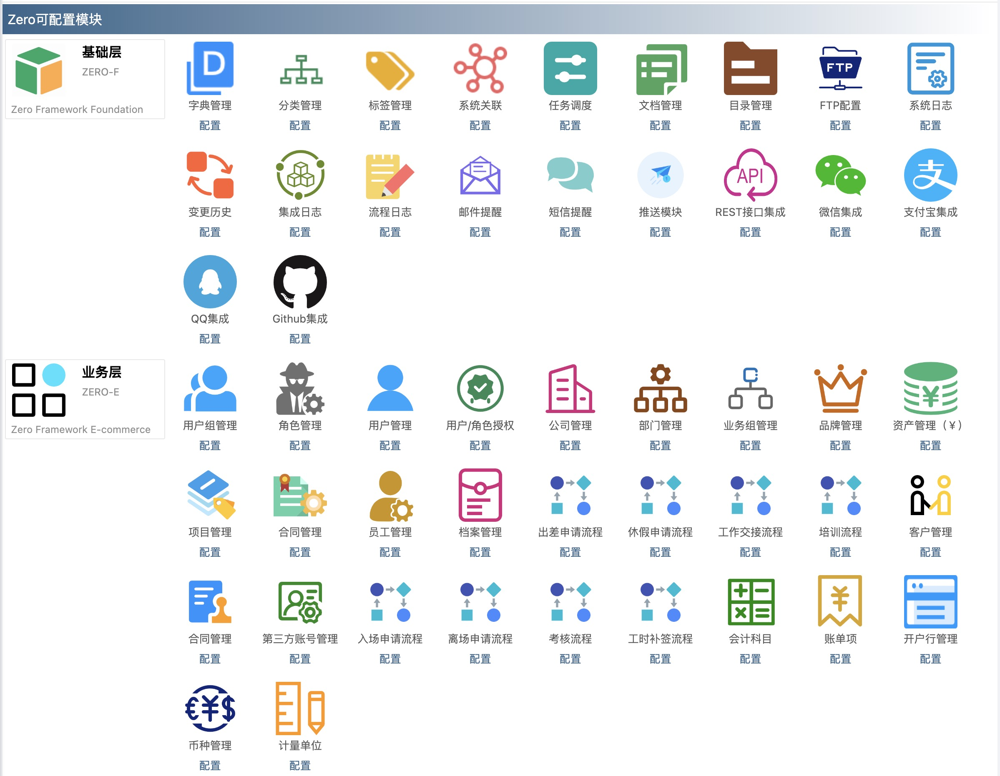
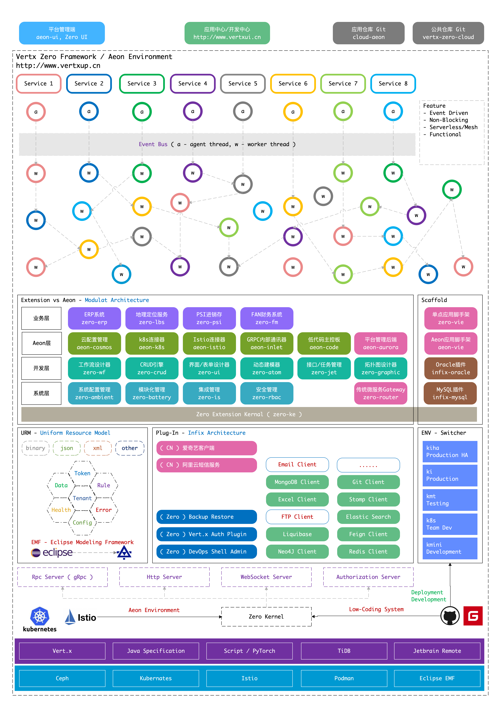

# Zero Framework Docs

[](https://maven-badges.herokuapp.com/maven-central/cn.vertxup/vertx-zero/)  [](https://www.apache.org/licenses/LICENSE-2.0.txt)

Zero is a middleware framework based on [Vert.x](http://vertx.io) and it could help software engineers focus on business
requirements instead of technical detail of Vert.x. The original idea of this framework came
from [Spring Boot](https://spring.io/projects/spring-boot/) as that there is no approximative tools in Vert.x sphere at
that time.

Zero has two metaphors, the original name is "Zero Up", "Up" means that I want to build a system that could be always
running up online, "Zero" means no more workload for high production and you can build your own system efficiently with
the default configuration only.

The latest Zero Micro Architecture ( [Aeon System](https://github.com/silentbalanceyh/vertx-zero-cloud) ) will be
deployed to [K8S](https://kubernetes.io/) with [Istio](https://istio.io/) environment, it's a future focused method to
build mature system with native cloud nature for more enterprise to execute critical valuable business efficiently. And
I hope it could act as an important tool for more enterprise to complete digital transformation to satisfy the
sustainable development, it could be high efficiently digital middleware in your side!

* Gitee Repo: <https://gitee.com/silentbalanceyh/vertx-zero>

## 1. Features

**Critical For Beginner**: Zero Framework has been re-factor many times, the features are very complex now, you can
refer following link for more details to know the power of Zero.

* [功能支持表/Feature List](FEATURES.md)

### 1.1. Structure

Zero Framework ( Latest Version ) contains five major projects as following:

| Name         | Comment                                                                                                                                         |
|--------------|-------------------------------------------------------------------------------------------------------------------------------------------------|
| vertx-gaia   | **Zero Core** Runtime, it contains minimum zero environment and you can deploy your projects on zero.                                           |
| vertx-ifx    | **Infix Architecture**, Useful plug-ins that could be supported by Zero and you can choose as required.                                         |
| vertx-import | Zero Usage dependency to perform development, it provides uniform entrance for your projects.                                                   |
| vertx-semper | **Aeon System**, The native cloud environment based on K8S with Istio.                                                                          |
| vertx-pin    | **Zero Extension** Modules, it provides common business features to satisfy many enterprise requirements such as [ODOO](https://www.odoo.com/). |

### 1.2. Usage Links

| Name                                                                   | Comment                                                                                                                                                               |
|------------------------------------------------------------------------|-----------------------------------------------------------------------------------------------------------------------------------------------------------------------|
| [Zero Ui](https://www.vertxui.cn)                                      | Zero UI Framework based on React and Ant Design.                                                                                                                      |
| [Zero Ai](https://www.vertxai.cn)                                      | Zero Ai Toolkit for rapid development.                                                                                                                                |
| [Zero Example](https://github.com/silentbalanceyh/vertx-zero-example)  | Zero original example demos for beginner.                                                                                                                             |
| [Old Official Document](DOCUMENT.md)                                   | The previous zero document before `0.4.8`, EN version.                                                                                                                |
| [《Zero冥思录》](https://lang-yu.gitbook.io/zero/)                          | The core training course for beginner to study Zero Framework, CN version.                                                                                            |
| [《Vert.x逐陆记》](https://lang-yu.gitbook.io/vert-x/)                      | The basic vert.x framework training course, ( In Progress )                                                                                                           |
| [《Zero云平台白皮书》](https://www.vertx-cloud.cn/document/doc-web/index.html) | The specification and guide for developer to process zero cloud platform / application. ( Include Zero Extension, Zero UI, Aeon Platform & Zero Ai etc ), CN version. |

### 1.3. Agreed Metadata Specification ( AMS )

In latest version `0.9.0`, I have published a new project `vertx-ams` under `vertx-gaia` project, it's a shared library
that could be cross Vertx, Spring and other project etc, it provide common features of JVM language and could help you
to do development more efficiently instead of `Util`. For more details you can
refer [《9.标准化》](https://www.vertx-cloud.cn/document/doc-web/index.html#_%E6%A0%87%E5%87%86%E5%8C%96).

The reference link is : <https://gitee.com/silentbalanceyh/vertx-zero/tree/master/vertx-gaia/vertx-ams>, you can add
following segment to your own project:

```xml

<dependency>
    <artifactId>vertx-ams</artifactId>
    <groupId>cn.vertxup</groupId>
    <version>${ZERO_VERSION}</version>
</dependency>
```

## 2. Overlook

Here I provide another view to let you know Zero Framework for more details.

### 2.1. Modulat

**Zero Extension** has been designed and re-factor to modulat environment, you can configure the modules as required,
all the modules could support following:

* OSGI Specification
* JDK 9 Module

here are some standard modules in Zero Extension.



### 2.2. Topology

The whole **Zero Framework ( Aeon Environment )** is as following:



### 2.3. Modeling

The latest version `0.9.0` has involved the specification of Industry Modeling to support more factors:

* ISO Specification such as ISO-27001, ISO-20000, ISO-9001 etc.
* Eclipse Modeling Framework supported ( EMF ), include UML generator for reverse engineering.
* BPMN 2.0 Specification supported.

### 2.3. Schematic

I have published the design schematic diagram of zero
to: [Zero Architecture](https://www.edrawmax.cn/online/share.html?code=6a3c11741e9411edab98b3f29ce75cdd), you can refer
the interaction graphic online and this working is on going. The main diagram of **Zero Booting** is as following:


## 3. Envrionment

* **Back-End**: You can download scaffold project from <https://gitee.com/silentbalanceyh/vertx-zero-scaffold> to
  initialize zero environment.
* **Front-End**: You can use command `ai init -name` instead,
  refer [Front-End Initialize](http://www.vertxai.cn/document/doc-web/module-ai.html#.init).

### 3.1. Configuration in pom.xml

If you want to use Zero framework, you can add following dependency into you `pom.xml` to use Zero:

=== "**JDK 17+**, vert.x 4.x"

    ```xml
    <parent>
        <artifactId>vertx-import</artifactId>
        <groupId>cn.vertxup</groupId>
        <version>0.9.0</version>
    </parent>
    ```

=== "**JDK 11+**, vert.x 4.x"

    ```xml
    <parent>
        <artifactId>vertx-import</artifactId>
        <groupId>cn.vertxup</groupId>
        <version>0.8.1</version>
    </parent>
    ```

=== "**JDK 8**, vert.x 3.9.x"

    ```xml
    <parent>
        <artifactId>vertx-import</artifactId>
        <groupId>cn.vertxup</groupId>
        <version>0.6.2</version>
    </parent>
    ```

### 3.2. Start Up ( Core )

In your project, you can provide main entry only as following to run Zero \( Annotated with `@Up` \) .

```java
import io.vertx.up.VertxApplication;
import io.vertx.up.annotations.Up;

@Up
public class Driver {

    public static void main(final String[] args) {
        VertxApplication.run(Driver.class);
    }
}
```

Once the Zero is up, you can see following logs in your console \( The default port is `6083` \):

```
[ ZERO ] ZeroHttpAgent Http Server has been started successfully. \
    Endpoint: http://0.0.0.0:6083/
```

### 3.3. Start Up ( Native Cloud )

When you want to enable **Aeon System**, you can switch the code as following:

```java
import io.vertx.aeon.AeonApplication;
import io.vertx.up.annotations.Up;

@Up
public class Driver {
    public static void main(final String[] args) {
        AeonApplication.run(Driver.class);
    }
}
```

## 4. Tips

### 4.1. Data Specification

In zero framework, we designed uniform data specification as following response data format for business usage:

```json
{
    "data":
}
```

After `0.5.2`, it could support freedom data format response as you wanted such as:

```shell
Hello World
1
...
```

If you want to switch to freedom mode, you can set the configuration in `vertx.yml` file:

```yaml
zero:
  freedom: true     # The default value of `freedom` is false.
```

### 4.2. Logging in Zero

You can use following function in your coding to get Logger component instead of `log4j` because we have re-designed the
detail implementation of logging system.

```java
// Zero Logger initialized, connect to vert.x logging system directly 
// but uniform managed by zero.

import io.horizon.log.Annal;

// Then in your class
public final class Statute {

    private static final Annal LOGGER = Annal.get(Statute.class);
    ......
}
```

### 4.3. Oracle Issue

From `0.8.0`, if you want to use Zero Extension of Dynamic Modeling, you need the project
of <https://github.com/silentbalanceyh/vertx-zero/tree/master/vertx-pin/zero-vista>. The latest version
is `0.8.0-SNAPSHOT`, you can modify the version and rebuild it. This feature is not needed in Core Framework.

> Above issue has been fixed in `0.9.0`.

## 5. Other Information

### 5.1. Cases List

> Because of Contract and Confidentiality Agreement, removed Sensitive information of customer include system name,
> customer name etc.

* **Deprecated**: Not Running Now
* **In Progress**: In Development or Upgraded Development
* **Running**: Running on Production Environment

| System Information                | Zero Version | Type       | System Status |
|-----------------------------------|--------------|------------|---------------|
| TLK Video Mobile System           | 0.4.6        | Commercial | Deprecated    |
| ISCCC Enterprise Evaluation       | 0.8.1        | Commercial | Running       |
| Digitization Cooperation Office   | 0.8.1        | Commercial | Running       |
| Commercial Opportunity Management | 0.8.1        | Commercial | Running       |
| Fruit PSI Management System       | 0.8.1        | Commercial | Running       |
| Government Procurement System     | 0.8.1        | Commercial | Running       |
| Invoice Verification Connector    | 0.8.1        | Commercial | Running       |
| CMDB Platform of Bank             | Latest       | Commercial | Running       |
| ITSM Platform of Bank             | Latest       | Commercial | Running       |
| Integration of PBC Bank           | Latest       | Commercial | Running       |
| ISO27000 Management Platform      | Latest       | Commercial | Running       |
| Zero Training Platform            | Latest       | Internal   | Running       |
| Data Analyzing Exam               | Latest       | Internal   | Running       |
| Aeon Native Cloud Platform        | Latest       | Internal   | In Progress   |
| Development Center                | Latest       | Internal   | In Progress   |
| K8S Integration Monitor System    | Latest       | Internal   | In Progress   |
| Medical Appliance Management      | Latest       | Commercial | In Progress   |
| Hotel Management Platform         | Latest       | Commercial | In Progress   |
| IoT Control System                | Latest       | Commercial | In Progress   |
| Specification Management Platform | Latest       | Commercial | In Progress   |

### 5.2. WeChat Group

You can send request to me: `445191171` to contact with the author of zero.


## DESIGNED IN CHINA（中国设计）